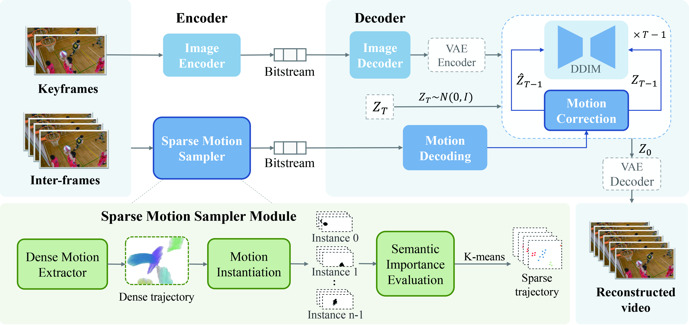

# 🌀 [AAAI-26] T-GVC: Trajectory-Guided Generative Video Coding at Ultra-Low Bitrates

## 🔍 Overview

**T-GVC** introduces a **trajectory-guided generative video coding** framework designed for **ultra-low bitrate** scenarios.  
By leveraging motion trajectories and powerful generative priors, T-GVC achieves **high temporal consistency** and **content fidelity** even at **ultra low bitrates (<0.005 bpp)**, surpassing both traditional codecs and existing generative methods.

<p align="center">
  <picture>
    <source media="(prefers-color-scheme: dark)" srcset="assert/figure2.jpg">
    
  </picture><br>
  <em>Figure 1. Overall framework of T-GVC.</em>
</p>

---

## 🚀 Demo

👉 **[Click here to view the visual results](https://chigland.github.io/T-GVC/)**  

<p align="center">
  <picture>
    <source media="(prefers-color-scheme: dark)" srcset="assert/figure5.jpg">
    
  </picture><br>
  <em>Figure 2.The R-D performance comparison results for HEVC Class B, Class C, UVG and MCL-JCV datasets.</em>
</p>

---

## 📦 Repository Structure

This project includes two major components of T-GVC:

- `encoder_module.py`: A module for selecting keyframes from video sequences and extracting motion trajectories for semantic-guided processing.
- `motion_correction.py`: An extended DDIM sampling module that enables motion-consistent latent updates using semantic trajectory masks.

#### 1. `encoder_module.py`

**Functionality:**

- Selects keyframes based on semantic similarity and scene transitions.
- Utilizes CoTracker to estimate dense motion trajectories.
- Applies HDBSCAN clustering to group trajectories into motion segments.
- Generates masks and clustered trajectories for use in motion-guided video generation.

**Inputs:**

- For detailed command-line arguments, please refer to the code.

**Outputs:**

- `.npy` files containing selected keyframe indices
- `.npy` files containing raw and clustered trajectory data

**Example usage:**

```
bash python encoder_module.py --tracker --data_config ./dataset_config_motion.json
```

#### 2. `motion_correction.py`

**Functionality:**

- Integrates custom trajectory masks into the sampling process to ensure semantic and temporal consistency.
- dual-stage variable-length video generation scheme

**Dependencies:**

- Internal modules from DynamiCrafter (Latent Video Diffusion Models) and it's easy to integrate the motion correction module into other diffusion-based models.

## 📄 Citation and Acknowledgment

This code is based on or inspired by:

- DynamiCrafter

If you find our work helpful, please cite us:

```bibtex
@article{wang2025t,
  title={T-GVC: Trajectory-Guided Generative Video Coding at Ultra-Low Bitrates},
  author={Wang, Zhitao and Man, Hengyu and Li, Wenrui and Wang, Xingtao and Fan, Xiaopeng and Zhao, Debin},
  journal={arXiv preprint arXiv:2507.07633},
  year={2025}
}
  
